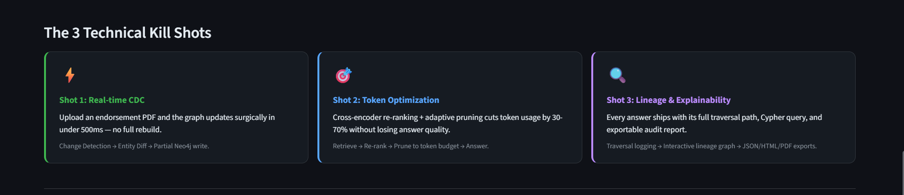
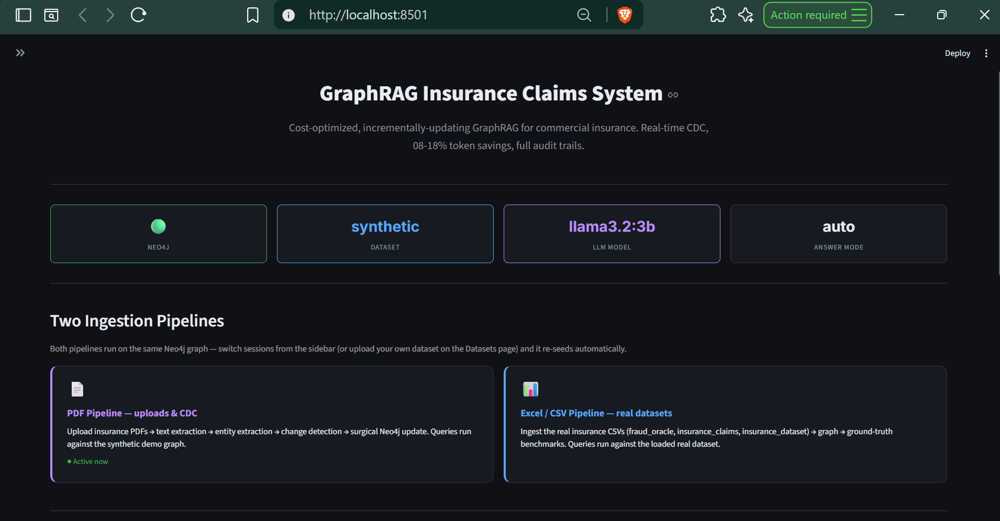
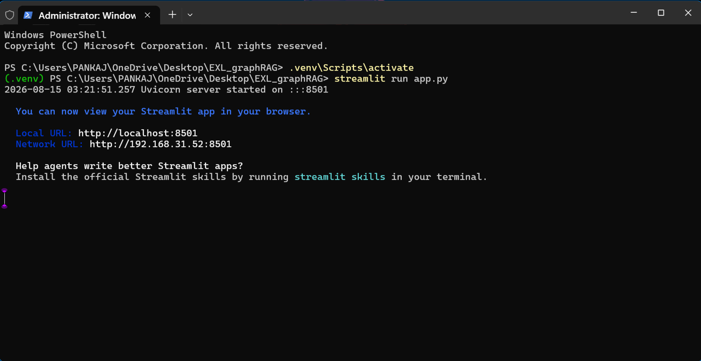
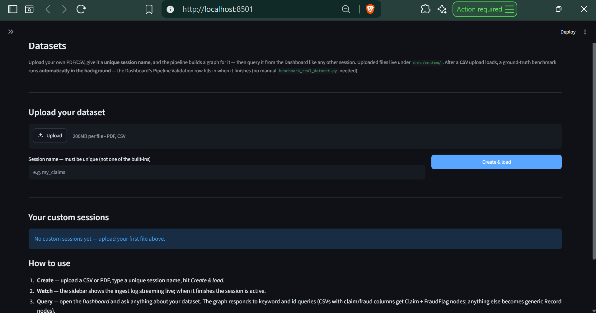

# GraphRAG Insurance Claims System

A **cost-optimized, incrementally-updating GraphRAG system** for commercial
insurance processing. Unstructured insurance PDFs → Neo4j knowledge graph →
multi-hop questions with full explainability — built around three production
bottlenecks EXL faces:



## The 3 Techinal kill shots
| Shot | Problem it solves | Implementation |
|---|---|---|
| **1 — CDC engine** | Re-indexing whole graphs on every update costs $$$ | PDF upload → LLM/heuristic entity extraction → **change detection** → **surgical Neo4j updates** (only affected nodes/edges, <500ms) |
| **2 — Token optimization** | Verbose graph retrieval wastes tokens | retrieve → **cross-encoder re-rank** (lexical BM25 fallback) → **adaptive context pruning** → live cost dashboard |
| **3 — Lineage & explainability** | Executives can't audit answers | every query logs its **traversal path + Cypher + nodes/edges** → interactive lineage UI + JSON/HTML/PDF audit reports |


## Two pipelines, one graph

Both ingestion paths feed the same Neo4j graph, and the web UI switches between
them without a terminal:

* **PDF pipeline** — upload insurance PDFs → text extraction → entity extraction
  → change detection (CDC) → surgical graph update (no full re-index). Queries
  run against the synthetic demo graph.
* **Excel/CSV pipeline** — ingest the real insurance CSVs in
  `data/Real_datasets/` → graph → ground-truth benchmarks. Queries run against
  the loaded real dataset.



## Quick start

```bash
# 1) Neo4j (Docker) + deps
docker compose up -d neo4j
python -m venv .venv && .venv/Scripts/pip install -r requirements.txt   # Windows
# (Linux/macOS:  .venv/bin/pip install -r requirements.txt)

# 2) Seed the demo graph
.venv/Scripts/python.exe scripts/seed_graph.py --reset --apply-schema

# 3) Run the pieces
.venv/Scripts/python.exe -m streamlit run dashboard.py                    # Shot 2: cost dashboard
.venv/Scripts/python.exe -m streamlit run src/graphrag/audit_ui.py        # Shot 3: audit trail
.venv/Scripts/python.exe -m uvicorn graphrag.api_server:app --app-dir src # REST API

# 4) Tests
.venv/Scripts/python.exe -m pytest
```


## Sessions (switch from the web UI)

The sidebar's **Active Session** selector in `app.py` exposes 4 sessions — 3
real Excel datasets + the PDF demo graph:

| Session | Pipeline | Source |
|---|---|---|
| `fraud_oracle` | Excel | 15,420 auto claims · 923 fraud labels |
| `insurance_claims` | Excel | 1,000 claims · 247 fraud labels |
| `insurance_dataset` | Excel | 13,000 claims (+ `data_synthetic` variant, same source) |
| `pdf_demo` | PDF | synthetic demo graph (policies / claims / endorsements) |

Picking a different session **re-seeds the graph automatically in the app's
backend process** (idempotent — no re-ingest if it is already loaded; the
**Re-seed this session** button forces a fresh one). Every page (Home,
Dashboard, Audit Trail) then queries that session's data, and the fraud
ground-truth comparisons follow the loaded dataset — no more copy-pasting
`ingest_real_dataset.py <name> --reset` into a second terminal.

.png)

### Bring your own dataset (custom sessions)

The **Datasets** page lets you upload your **own PDF or CSV** and query it
through the same pipeline:

* Upload one or more files → give the session a **unique name** (must not
  collide with the built-in sessions or another custom session) → the graph is
  re-seeded and the session appears in the sidebar selector like any other.
* **CSV** — a generic adapter maps claim-like columns (claim / fraud / amount /
  loss / incident / coverage) onto `(:Claim)` / `(:FraudFlag)` nodes with
  `FRAUD_DETECTED` edges; anything else becomes generic `(:Record)` nodes with
  every column as a property.
* **PDF** — processed by the standard extraction pipeline (pdf_processor →
  entity_extractor → graph_updater) with entity-derived edges.
* Custom sessions can be **renamed** (the graph marker is re-stamped on the
  next switch) and **removed** from the **Datasets** page. They are persisted
  in `data/custom_sessions.json` and re-seeded by
  `scripts/ingest_custom_dataset.py <name> --reset`, so the API's
  `POST /api/v1/session` and the streaming sidebar progress work for them too.



## Real-dataset validation (the proof)

Validated end-to-end against the **3 distinct real datasets** (4 CSV files) in
`data/Real_datasets/` — `insurance_dataset.csv` and `data_synthetic.csv` are two
forms of the same Kaggle source (one archive ships both CSVs):

* **10,000 ground-truth queries** across the 3 real Excel sessions — `fraud_oracle` 5,500, `insurance_dataset` 3,900, `insurance_claims` 600 — **100% retrieval & pruning accuracy on every single query** (10,200 total including the synthetic variant + PDF demo graph, each 100/100)
* **Fraud detection: P/R/F1 = 100%** over all **1,212 real fraud labels** (923 + 247 + the demo graph's 42) plus 2,253 clean claims — zero false positives, zero false negatives
* **Edge cases: 20/20** — head/middle/tail boundary queries over every real file
* **Scale: 53,503 rows → 40,259 customers** ingested in ~16s, benchmark accuracy holds at 40k+ entities

The Dashboard's **Pipeline Validation** table shows all of this per session — the
3 real datasets, the **PDF demo graph** (100 ground-truth queries from
`scripts/benchmark_real_dataset.py synthetic`, plus the legacy 20/20 edge-case
file as fallback) and any **custom uploads** — with the ● marking the
currently loaded session. A newly uploaded dataset appears as a row immediately,
and **CSV uploads are benchmarked automatically**: as soon as the session seeds,
`scripts/benchmark_real_dataset.py --custom-session <name>` and (when the CSV
has a fraud column) `scripts/benchmark_fraud_detection.py --custom-session
<name>` run in the background, so the row fills in with retrieval/pruning
accuracy, token savings **and fraud precision/recall** — no manual benchmark
step needed. The **PDF demo row** shows real fraud P/R/F1 too (42 fraud labels
from the demo graph, `fraud_detection_synthetic.json`); datasets whose source
has no fraud column are honestly labeled **"no labels"** instead of "—".

Full details + honest caveats: [`data/real_dataset_results.md`](data/real_dataset_results.md).

**Consolidated proof file** — `scripts/export_benchmark_proof.py` merges all raw
benchmark JSONs into one
[`data/benchmarks/benchmark_results.json`](data/benchmarks/benchmark_results.json):
weighted accuracy, total raw vs optimized tokens, fraud P/R/F1, live lexical vs
cross-encoder rerank latency, and a projected annual cost saving
(`--price-per-1k-tokens` / `--queries-per-day` overridable). Regenerate it after
any benchmark run:
`python scripts/export_benchmark_proof.py`.

## Auto-pipeline

`scripts/auto_pipeline.py` watches `data/Real_datasets/` and re-runs the
validation chain whenever a CSV changes — switching the loaded graph through
`POST /api/v1/session` first (falling back to a direct ingest when the API is
down), so each benchmark runs inside its own session — then refreshes the
dashboard's validation table. See the report for usage.

## Docs

* [`DEPLOYMENT.md`](DEPLOYMENT.md) — Docker, environment config, backups, CI/CD
* [`API_DOCS.md`](API_DOCS.md) — REST endpoint reference
* [`docs/graph_schema.md`](docs/graph_schema.md) — ontology
* [`how_to_run.md`](how_to_run.md) — run commands
* [`GraphRAG Insurance Claims System - Production-Ready Plan.md`](GraphRAG%20Insurance%20Claims%20System%20-%20Production-Ready%20Plan.md) — the original plan


## Repository layout

```
├── app.py            # main Streamlit app (Home / Dashboard / Audit Trail / Datasets)
├── dashboard.py                # Shot 2: standalone cost-optimization dashboard
├── Dockerfile · Dockerfile.dashboard · docker-compose.yml · docker-compose.e2e.yml
├── pyproject.toml · requirements.txt · requirements-api.txt
├── README.md
├── How_to_run.md
|
│
├── src/graphrag/               # core library (28 modules)
│   │
│   ├── PDF + CDC pipeline (Shot 1)
│   │   ├── pdf_processor.py        # text/table extraction from insurance PDFs
│   │   ├── entity_extractor.py     # LLM (Ollama) + heuristic entity extraction, prompts
│   │   ├── change_detector.py      # CDC: added / modified / deleted entities
│   │   ├── graph_updater.py        # surgical Neo4j updates — no full re-index
│   │   └── graph_store.py          # node/edge persistence helpers
│   │
│   ├── Retrieval + token optimization (Shot 2)
│   │   ├── graph_retriever.py      # multi-hop Neo4j sub-graph retrieval + numeric seeds
│   │   ├── reranker.py             # cross-encoder (neural) ↔ lexical BM25, auto-fallback
│   │   ├── context_pruner.py       # token-budget context pruning
│   │   ├── token_counter.py        # tiktoken-based token accounting
│   │   └── answer_generator.py     # Ollama LLM answer + extractive fallback
│   │
│   ├── Lineage + explainability (Shot 3)
│   │   ├── traversal_logger.py     # query → nodes/edges → answer audit trail
│   │   ├── path_extractor.py       # Cypher path reconstruction
│   │   ├── lineage_visualizer.py   # pyvis graph rendering
│   │   ├── audit_reporter.py       # JSON / HTML / PDF audit report export
│   │   └── audit_ui.py             # audit trail page
│   │
│   ├── Orchestration + data
│   │   ├── query_pipeline.py       # end-to-end: retrieve → rank → prune → answer
│   │   ├── sessions.py             # session switching, re-seed, auto-benchmark triggers
│   │   ├── custom_sessions.py      # upload-your-own PDF/CSV registry + adapters
│   │   └── fraud_ground_truth.py   # verdict parsing + fraud label loading
│   │
│   └── Production hardening (Phase 5)
│       ├── api_server.py           # FastAPI: /upload, /query, /session, /health, /metrics
│       ├── security.py · rate_limiter.py · validators.py · exception_handlers.py
│       ├── health_check.py · monitoring.py · logger_config.py · config.py
│
├── scripts/                      # 22 operational scripts
│   ├── seed_graph.py · ingest_real_dataset.py · ingest_custom_dataset.py
│   ├── benchmark_real_dataset.py · benchmark_fraud_detection.py · benchmark_edge_cases.py
│   ├── export_benchmark_proof.py · build_benchmark_queries.py · auto_pipeline.py
│   ├── e2e_cdc_demo.py · smoke_test_api.py · backup_neo4j.py
│   └── verify_*.py                # per-feature verification (dashboard, audit, cypher, …)
│
├── tests/                        # 186 test functions (~281 collected) across 27 files
│   ├── unit: reranker, pruner, token_counter, change_detector, graph_updater, …
│   ├── integration: api (upload/query/session), audit flow, custom sessions, fraud benchmark
│   └── production: security, rate_limiter, validators, health endpoints
│
├── data/
│   ├── Real_datasets/             # fraud_oracle (15.4k) · insurance_claims (1k) · insurance_dataset + data_synthetic (13k + 53.5k)
│   ├── samples/                   # 200 claims · 100 policies · 50 endorsements · ground truth
│   ├── pdfs/                      # synthetic insurance PDFs
│   ├── benchmarks/                # per-dataset JSONs + consolidated benchmark_results.json
│   ├── audit_trail/               # JSONL query audit trail + exported reports
│   └── custom/ · custom_sessions.json   # user uploads + session registry
│
├── .streamlit/config.toml · .github/workflows/ci.yml
├── docs/                          # graph_schema.md · schema.cypher · LOOM_SCRIPT.md
├── prompts/                       # extraction + answer prompt templates
└── Read doc/                      # research notes: BM25, lexical vs cross-encoder, step-by-step output
```
