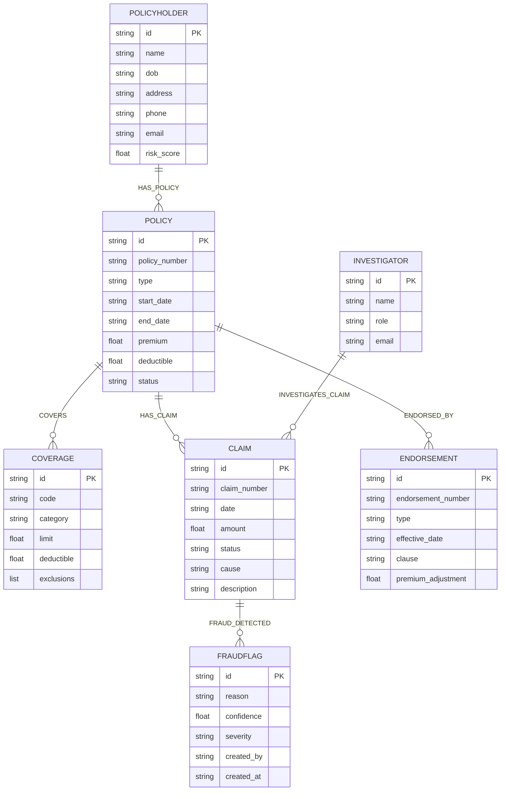

# GraphRAG Insurance — Graph Schema (Ontology) — v1

**Phase 1 deliverable.** Defines the knowledge-graph ontology for the commercial insurance domain used across all phases (CDC in Phase 2, retrieval in Phase 3, lineage in Phase 4).

- **Graph DB:** Neo4j 5.x (Community), APOC enabled
- **Constraints & indexes:** see [`schema.cypher`](schema.cypher)
- **Sample data generator:** [`scripts/data_pipeline.py`](../scripts/data_pipeline.py)

---

## 1. Design Principles

| Principle | Rationale |
|-----------|-----------|
| **Deterministic IDs** | Every entity carries a stable, human-readable `id` (e.g. `POL-0001`, `CLM-0001`). CDC diffs and audit trails depend on stable IDs. |
| **One source document → one snapshot** | Every PDF has a `doc_id`; its entities are re-created/updated together (Phase 2 `graph_store.py` keeps the per-doc snapshot). |
| **Labels = business nouns** | 7 core labels only; no over-granular labels. Properties carry the detail. |
| **Relationships = verbs** | 6 canonical relationship types (below). No generic `RELATED_TO` — every edge must have a business meaning. |
| **Ground truth by construction** | Synthetic PDFs are generated *from* these records, so the correct entities are known (drives CDC + accuracy benchmarks). |

---

## 2. Entity Catalog

### 2.1 `Policyholder`
The individual or business that owns a policy.

| Property | Type | Required | Notes |
|----------|------|----------|-------|
| `id` | string | ✅ | e.g. `PH-0001` — unique |
| `name` | string | ✅ | Full name / company name |
| `dob` | string (ISO date) | ✅ | `YYYY-MM-DD` |
| `address` | string | ✅ | Free-text address |
| `phone` | string | ✅ | |
| `email` | string | ✅ | |
| `risk_score` | float (0–100) | ✅ | Higher = riskier |

### 2.2 `Policy`
An insurance contract between a policyholder and the carrier.

| Property | Type | Required | Notes |
|----------|------|----------|-------|
| `id` | string | ✅ | e.g. `POL-0001` — unique |
| `policy_number` | string | ✅ | External-facing number, e.g. `CGL-2024-0001` |
| `type` | enum | ✅ | See §4.1 |
| `start_date` | string (ISO) | ✅ | |
| `end_date` | string (ISO) | ✅ | |
| `premium` | float | ✅ | Annual premium, USD |
| `deductible` | float | ✅ | USD |
| `status` | enum | ✅ | See §4.2 |

### 2.3 `Coverage`
A scope of protection attached to a policy.

| Property | Type | Required | Notes |
|----------|------|----------|-------|
| `id` | string | ✅ | e.g. `COV-0001` — unique |
| `code` | string | ✅ | Coverage code, e.g. `CGL-A` |
| `category` | enum | ✅ | See §4.3 |
| `limit` | float | ✅ | Coverage limit, USD |
| `deductible` | float | ✅ | USD |
| `exclusions` | list[string] | ✅ | Exclusion clauses |

### 2.4 `Claim`
A demand for payment made under a policy.

| Property | Type | Required | Notes |
|----------|------|----------|-------|
| `id` | string | ✅ | e.g. `CLM-0001` — unique |
| `claim_number` | string | ✅ | e.g. `CLM-2024-0001` |
| `date` | string (ISO) | ✅ | Loss/incident date |
| `amount` | float | ✅ | Claimed amount, USD |
| `status` | enum | ✅ | See §4.4 |
| `cause` | string | ✅ | Free-text cause of loss |
| `description` | string | ✅ | Narrative |
| `policy_id` | string | ✅ | Serialization-only join field in the sample JSON (the graph link is modeled as `HAS_CLAIM`) |

### 2.5 `Endorsement`
A rider that amends a policy after inception.

| Property | Type | Required | Notes |
|----------|------|----------|-------|
| `id` | string | ✅ | e.g. `END-0001` — unique |
| `endorsement_number` | string | ✅ | e.g. `END-2024-0001` |
| `type` | string | ✅ | e.g. `ADDITIONAL_INSURED`, `LIMIT_INCREASE` |
| `effective_date` | string (ISO) | ✅ | |
| `clause` | string | ✅ | Full clause text (the PDF text) |
| `premium_adjustment` | float | ✅ | +/– USD |
| `policy_id` | string | ✅ | Serialization-only join field in the sample JSON (the graph link is modeled as `ENDORSED_BY`) |

### 2.6 `FraudFlag`
A marker attached to a claim by an investigator or rule engine.

| Property | Type | Required | Notes |
|----------|------|----------|-------|
| `id` | string | ✅ | e.g. `FRD-0001` — unique |
| `reason` | string | ✅ | e.g. "Claim filed within 7 days of policy inception" |
| `confidence` | float (0–1) | ✅ | Rule confidence |
| `severity` | enum | ✅ | `LOW` / `MEDIUM` / `HIGH` — see §4.5 |
| `created_by` | string | ✅ | Investigator id or `SYSTEM` |
| `created_at` | string (ISO) | ✅ | |

### 2.7 `Investigator`
Claims investigator who reviews flagged/suspicious claims.

| Property | Type | Required | Notes |
|----------|------|----------|-------|
| `id` | string | ✅ | e.g. `INV-0001` — unique |
| `name` | string | ✅ | |
| `role` | string | ✅ | e.g. `SENIOR_INVESTIGATOR` |
| `email` | string | ✅ | |

---

## 3. Relationship Catalog

| Relationship | Direction | Cardinality | Meaning | Example Cypher |
|--------------|-----------|-------------|---------|----------------|
| `HAS_POLICY` | `(:Policyholder)-[:HAS_POLICY]->(:Policy)` | 1 → N | A policyholder owns policies | `MATCH (ph:Policyholder {id:'PH-0001'})-[:HAS_POLICY]->(p:Policy) RETURN p` |
| `COVERS` | `(:Policy)-[:COVERS]->(:Coverage)` | 1 → N | A policy provides coverages | `MATCH (p:Policy {id:'POL-0001'})-[:COVERS]->(c:Coverage) RETURN c.code, c.limit` |
| `HAS_CLAIM` | `(:Policy)-[:HAS_CLAIM]->(:Claim)` | 1 → N | A policy has claims | `MATCH (p:Policy {id:'POL-0001'})-[:HAS_CLAIM]->(c:Claim) RETURN c` |
| `ENDORSED_BY` | `(:Policy)-[:ENDORSED_BY]->(:Endorsement)` | 1 → N | A policy is amended by endorsements | `MATCH (p:Policy {id:'POL-0001'})-[:ENDORSED_BY]->(e:Endorsement) RETURN e` |
| `FRAUD_DETECTED` | `(:Claim)-[:FRAUD_DETECTED]->(:FraudFlag)` | 1 → N | A claim has fraud flags | `MATCH (c:Claim {id:'CLM-0001'})-[:FRAUD_DETECTED]->(f:FraudFlag) RETURN f.reason` |
| `INVESTIGATES_CLAIM` | `(:Investigator)-[:INVESTIGATES_CLAIM]->(:Claim)` | 1 → N | An investigator reviews claims | `MATCH (i:Investigator {id:'INV-0001'})-[:INVESTIGATES_CLAIM]->(c:Claim) RETURN c` |

> **Naming note:** the earlier draft audit mock used `FRAUD_FLAG`; the canonical name going forward is **`FRAUD_DETECTED`** (matches Phase 1 relationship list). Phase 4 `traversal_logger`/`path_extractor` will use `FRAUD_DETECTED`.

### 3.1 Multi-hop example (the Phase 4 "fraud" query)

```cypher
MATCH (ph:Policyholder)-[:HAS_POLICY]->(po:Policy)-[:HAS_CLAIM]->(c:Claim)-[:FRAUD_DETECTED]->(f:FraudFlag)
WHERE c.id = "CLM-0001"
RETURN ph.name AS policyholder, po.policy_number AS policy, c.id AS claim, f.reason AS fraud_reason
```

---

## 4. Enumerations

### 4.1 `Policy.type`
`COMMERCIAL_GENERAL_LIABILITY` · `COMMERCIAL_PROPERTY` · `WORKERS_COMPENSATION` · `AUTO_FLEET` · `PROFESSIONAL_LIABILITY`

### 4.2 `Policy.status`
`ACTIVE` · `EXPIRED` · `CANCELLED` · `LAPSED`

### 4.3 `Coverage.category`
`LIABILITY` · `PROPERTY` · `AUTO` · `EMPLOYEE_INJURY` · `ERRORS_OMISSIONS`

### 4.4 `Claim.status`
`SUBMITTED` · `IN_REVIEW` · `APPROVED` · `DENIED` · `PAID`

### 4.5 `FraudFlag.severity`
`LOW` · `MEDIUM` · `HIGH`

---

## 5. ER Diagram



> `docs/ER_diagram.png`: export this mermaid diagram (mermaid.live / GitHub rendering) or redraw in Excalidraw/Lucidchart for the pitch.

---

## 6. Sample Data Files (`data/samples/`)

Generated by `scripts/data_pipeline.py`. Ground truth is known **by construction** — each record below is what a perfect entity-extractor would produce from the corresponding PDF.

### 6.1 `policies.json` (100 policies)
Flat record — the policy itself is the document, so `id` doubles as `doc_id`:

```json
{
  "id": "POL-0001",
  "policy_number": "CGL-2024-0001",
  "type": "COMMERCIAL_GENERAL_LIABILITY",
  "start_date": "2024-01-01",
  "end_date": "2024-12-31",
  "premium": 12500.0,
  "deductible": 2500.0,
  "status": "ACTIVE",
  "policyholder": { "id": "PH-0001", "name": "...", "dob": "...", "address": "...", "phone": "...", "email": "...", "risk_score": 42.0 },
  "coverages": [ { "id": "COV-0001", "code": "CGL-A", "category": "LIABILITY", "limit": 1000000.0, "deductible": 2500.0, "exclusions": ["Intentional acts"] } ],
  "endorsements": [ { "id": "END-0001", "endorsement_number": "END-2024-0001", "type": "ADDITIONAL_INSURED", "effective_date": "2024-03-01", "clause": "...", "premium_adjustment": 750.0 } ]
}
```

### 6.2 `claims.json` (200 claims)
```json
{
  "doc_id": "CLM-0001",
  "claim": { "id": "CLM-0001", "claim_number": "CLM-2024-0001", "policy_id": "POL-0001", "date": "2024-02-15", "amount": 45000.0, "status": "IN_REVIEW", "cause": "Fire damage", "description": "..." },
  "fraud_flag": { "id": "FRD-CLM-0001", "reason": "Claim filed within 7 days of policy inception", "confidence": 0.92, "severity": "HIGH", "created_by": "SYSTEM", "created_at": "..." },
  "investigator": { "id": "INV-0002", "name": "...", "role": "SENIOR_INVESTIGATOR", "email": "..." }
}
```

> `fraud_flag` is always present (may be `null`); `investigator` is **omitted** when no investigator is assigned. Fraud-flag ids are derived from the claim id (`FRD-CLM-0001`).

### 6.3 `endorsements.json` (50 endorsements)
```json
{ "id": "END-0001", "endorsement_number": "END-2024-0001", "policy_id": "POL-0001", "type": "ADDITIONAL_INSURED", "effective_date": "2024-03-01", "clause": "...", "premium_adjustment": 750.0 }
```

### 6.4 `ground_truth.json`
Maps each generated PDF to the canonical entities + relationships it contains. Consumed by Phase 2 CDC tests and Phase 3 accuracy benchmarks.

```json
{
  "POL-0001.pdf": {
    "entities": [ { "label": "Policyholder", "id": "PH-0001" }, { "label": "Policy", "id": "POL-0001" } ],
    "relationships": [ { "from": "PH-0001", "type": "HAS_POLICY", "to": "POL-0001" } ]
  },
  "CLM-0001.pdf": {
    "entities": [ { "label": "Claim", "id": "CLM-0001" } ],
    "relationships": [ { "from": "POL-0001", "type": "HAS_CLAIM", "to": "CLM-0001" } ]
  }
}
```

> Claim-document ground truth includes the **cross-document** `HAS_CLAIM` edge: the Policy is referenced by id inside claim PDFs (not fully described), so Phase 2 CDC can still verify the policy→claim link.

---

## 7. CDC Mapping (Phase 2 contract)

`change_detector.py` returns `{added, modified, deleted}`; `graph_updater.py` translates as follows:

| Change | Graph operation |
|--------|-----------------|
| entity **added** | `MERGE (n:Label {id: ...})` + set properties + connect relationships |
| entity **modified** | `MATCH (n:Label {id: ...}) SET n.prop = ...` (only changed properties) |
| entity **deleted** | `MATCH (n:Label {id: ...}) DETACH DELETE n` |
| relationship **added** | `MATCH (a {id}), (b {id}) MERGE (a)-[:REL]->(b)` |
| relationship **deleted** | `MATCH (a {id})-[r:REL]->(b {id}) DELETE r` |

Cross-document edges (e.g. `HAS_CLAIM` from a claim PDF to a policy node created by a policy PDF) are resolved by id — MERGE is idempotent, so ingest order does not matter.

Entity fingerprint: `(label, id)` — the identity used for all diffs.
